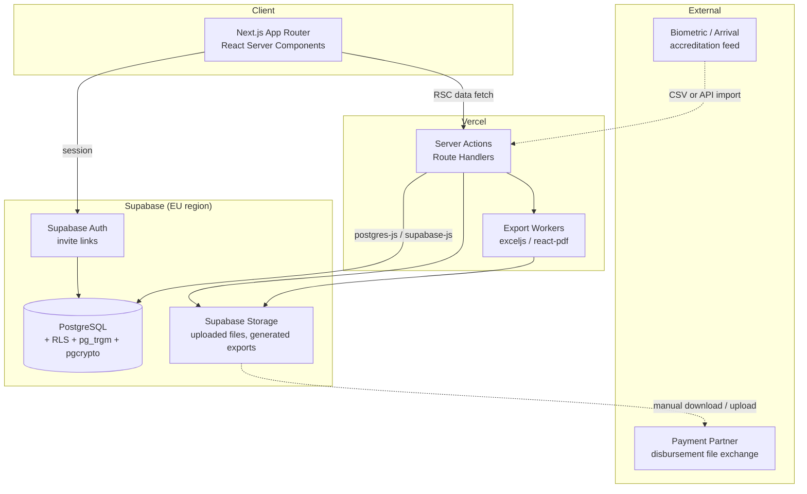

# PRD — NDG Payment Accreditation Portal

_Generated 2026-08-15 from `vision.json` and `docs/product-vision.md`. Built for execution by Claude Code._

> **Visual tokens not yet defined. Run `/plaid design` before implementation begins.** This document references component names and token names that will live in `docs/design.md`; it deliberately does not define colours, typography or spacing.

---

## 1. Overview

### Product Summary

**NDG Payment Accreditation Portal** — the permanent system of record that decides who is eligible to be paid at each edition of the Niger Delta Games and produces the file that pays them.

The portal consolidates accreditation, beneficiary records, payment eligibility, disbursement and reporting for the Niger Delta Games across nine states (Abia, Akwa Ibom, Bayelsa, Cross River, Delta, Edo, Imo, Ondo, Rivers). Its defining behaviour is that payment eligibility is *computed* from accreditation status rather than asserted by whoever last edited a file. It is edition-scoped from the schema up, because the Games run annually and the Secretariat will use the same system every year.

### Objective

This PRD covers the MVP defined in `docs/product-vision.md` § 3 — the **eligibility-to-disbursement spine**:

1. Edition-scoped data model separating durable people from per-edition participation
2. Beneficiary import with validation, mandatory national identifier, and text-safe account numbers
3. Duplicate detection with a human review queue
4. Accreditation status and computed payment eligibility
5. Disbursement file generation and payment result import
6. Role and state scoped access enforced by row-level security
7. Filter-respecting Excel and PDF export
8. Access logging

Explicitly **not** covered: executive dashboard and reports, Upload Centre file management, wallet/card lifecycle states, Operations Committees financials, Guests, biometric device integration, edition rollover UI. See § 13.

### Market Differentiation

The technical implementation must deliver two things that a spreadsheet structurally cannot. First, **eligibility as a derived value** — there must be no code path, screen, or API that marks a person payable without their accreditation status supporting it. This is enforced in the database with a generated column and a guarded view, not in application logic, because application logic can be bypassed by the next developer. Second, **the disbursement file must originate here**. As long as the payment schedule is assembled elsewhere, the portal is a reporting layer. The export must produce a file the payment partner accepts unedited: correct field order, institution codes rather than bank names, and account numbers preserved as text with leading zeros intact.

### Magic Moment

The payment lead filters to `2026 → Delta → Basketball → eligible`, clicks export, and receives a disbursement file the payment vendor accepts without a single manual correction.

Technically this requires: filter state serialised into the export request so the file matches the screen exactly; eligibility precomputed so filtering is a `WHERE` clause and not a calculation; account numbers stored and emitted as `TEXT`; bank names resolved to institution codes through a mapping table; and generation completing inside the HTTP timeout for the largest realistic result set (~3,000 rows). Export must be **fast enough to feel like a download, not a job** — under 10 seconds for 3,000 rows.

### Success Criteria

| Criterion | Threshold |
|---|---|
| Exported record count matches on-screen filtered count | Exactly, always — assert in an automated test |
| Disbursement export, 3,000 rows | < 10s end to end |
| Filtered list query, 50k participation rows | < 400ms p95 |
| Leading zeros preserved through import → storage → export | 100%, verified against the real Edo sample file |
| Unaccredited person appearing in a payable export | Zero — enforced by view definition and asserted per role in tests |
| Cross-role access leakage | Zero — one automated test per role asserting what it cannot see |
| P0 functional requirements complete with tests | 100% |

---

## 2. Technical Architecture

### Architecture Overview



Note the dotted lines: the payment partner and biometric owner are **file-exchange boundaries, not live integrations**. Neither is under our control, and both must degrade to manual upload without the system breaking.

### Chosen Stack

| Layer | Choice | Rationale |
|---|---|---|
| Frontend | Next.js (App Router) | Largest ecosystem and the best-supported path with Claude Code. Server-side rendering keeps dense, heavily filtered beneficiary tables responsive; server actions keep disbursement generation and bulk import off the client. Pairs cleanly with Supabase. |
| Backend | Supabase | The workload is relational reporting and reconciliation with a strict permission model, not real-time collaboration. Supabase supplies Postgres, auth, storage and row-level security in one managed service, which suits a solo build under twelve weeks. |
| Database | PostgreSQL (Supabase managed, EU region) | Textbook relational schema. RLS enforces the state-and-edition viewer rule in the database rather than in React; `pg_trgm` gives indexed trigram similarity for names with inconsistent case and word order; `pgcrypto` encrypts identifiers at rest. EU region because Supabase offers no African region and the US is not currently designated adequate by the NDPC — SCCs go in the processing agreement. |
| Auth | Supabase Auth with invite links | Native to the backend and integrates directly with RLS, so identity and permissions share one source. Invite links replace the spec's emailed generated passwords — no credential travels by email. |
| Payments | None | The portal charges nobody. Money leaves via a disbursement file to the payment partner. No payment processor is in scope. |

### Stack Integration Guide

**Setup order.** Get these right in sequence; reordering causes rework.

1. **Create the Supabase project in an EU region** (`eu-central-1` Frankfurt or `eu-west-1` Ireland). The region cannot be changed later without a migration — decide before writing any schema.
2. **Enable extensions first:** `create extension if not exists pg_trgm; create extension if not exists unaccent; create extension if not exists pgcrypto;`. Do this in the first migration so later migrations can depend on them.
3. **Write the schema and RLS policies together, in the same migration.** Never create a table without its policies. A table with RLS enabled and no policy denies everything, which is a safe default; a table without RLS enabled is readable by any authenticated user, which is not.
4. **Seed reference data** (states, banks with institution codes, categories) before any participation table exists, so foreign keys are satisfiable.
5. **Scaffold Next.js with `@supabase/ssr`**, not the deprecated auth-helpers. Cookie-based sessions in middleware, server client in RSCs and server actions.
6. **Build import before UI.** A CLI or route handler that ingests the real Edo file end to end is worth more than any screen at this stage.

**Environment variables.**

```
NEXT_PUBLIC_SUPABASE_URL=
NEXT_PUBLIC_SUPABASE_ANON_KEY=
SUPABASE_SERVICE_ROLE_KEY=        # server-only, never exposed to client
DATABASE_URL=                     # direct connection for migrations
PII_ENCRYPTION_KEY=               # pgcrypto symmetric key for BVN/NIN, server-only
NEXT_PUBLIC_APP_URL=
```

**Known gotchas, specific to this combination:**

- **`@supabase/ssr` cookie handling in Next.js middleware is the single most common source of "logged out on refresh".** Use the documented `createServerClient` pattern with `getAll`/`setAll` and refresh the session in middleware on every request.
- **RLS is bypassed by the service role key.** Any server action using the service-role client is unprotected. Use the *user-scoped* server client for all read paths so policies apply; reserve service-role strictly for import, export generation, and admin tasks — and add a code comment at every use explaining why.
- **`supabase-js` caps rows at 1,000 by default.** Exports must paginate explicitly or use a direct `postgres-js` connection. Silently truncated exports are the worst possible bug in this product.
- **`.csv()` and spreadsheet libraries will coerce numeric-looking strings.** Account numbers must be written with an explicit text format (`exceljs` cell `numFmt: '@'`), or 16 of 45 sample records lose their leading zeros.
- **Generated columns cannot reference other tables.** Eligibility depends on accreditation status held on the same row, which is why the schema denormalises accreditation onto `participations` rather than joining at query time.
- **Trigram indexes need the operator class:** `create index ... using gin (normalised_name gin_trgm_ops)`. Without it, `similarity()` sequential-scans and dedup becomes unusable at scale.

### Repository Structure

```
ndg-portal/
├── src/
│   ├── app/
│   │   ├── (auth)/
│   │   │   ├── sign-in/page.tsx
│   │   │   └── accept-invite/page.tsx
│   │   ├── (app)/
│   │   │   ├── layout.tsx                 # shell: edition switcher, nav, role gate
│   │   │   ├── page.tsx                   # editor landing (dashboard placeholder)
│   │   │   ├── participants/
│   │   │   │   ├── page.tsx               # state selection (editors) / auto-scoped (viewers)
│   │   │   │   └── [state]/[category]/page.tsx
│   │   │   ├── personnel/
│   │   │   │   └── [category]/page.tsx    # LOC, MOC, technical leads/officials, liaisons, volunteers
│   │   │   ├── drm/[category]/page.tsx
│   │   │   ├── accreditation/page.tsx
│   │   │   ├── payments/
│   │   │   │   ├── page.tsx               # batches
│   │   │   │   └── [batchId]/page.tsx
│   │   │   ├── review/page.tsx            # duplicate review queue
│   │   │   ├── imports/page.tsx
│   │   │   └── admin/
│   │   │       ├── users/page.tsx
│   │   │       ├── editions/page.tsx
│   │   │       └── reference/page.tsx     # categories, committees, sports, banks, rates
│   │   └── api/
│   │       ├── export/route.ts            # xlsx / pdf
│   │       ├── disbursement/route.ts      # partner-format file
│   │       └── import/route.ts
│   ├── components/
│   │   ├── ui/                            # primitives per docs/design.md
│   │   └── features/
│   │       ├── filters/                   # FilterBar, useFilterState (URL-synced)
│   │       ├── table/                     # DataTable, pagination, column config
│   │       ├── import/
│   │       └── review/
│   ├── lib/
│   │   ├── supabase/{server,client,middleware}.ts
│   │   ├── auth/{session,roles,guards}.ts
│   │   ├── import/{parse,validate,normalise,dedupe}.ts
│   │   ├── export/{xlsx,pdf,disbursement}.ts
│   │   ├── domain/{eligibility,nuban,names,banks}.ts
│   │   └── audit/log.ts
│   └── types/database.ts                  # generated: supabase gen types
├── supabase/
│   ├── migrations/                        # numbered SQL migrations
│   ├── seed.sql                           # states, banks + institution codes, categories
│   └── tests/                             # pgTAP RLS assertions
├── tests/
│   ├── rls/                               # one file per role
│   ├── import/fixtures/                   # real Edo sample + corrupted variants
│   └── e2e/
├── docs/                                  # PLAID documents
└── middleware.ts
```

### Infrastructure & Deployment

- **Frontend:** Vercel, connected to the repository. Preview deployments per branch; production on `main`.
- **Database and auth:** Supabase managed, EU region. Enable **daily backups** on day one — this is beneficiary and payment data, and point-in-time recovery is worth the paid tier.
- **Migrations:** Supabase CLI, checked into `supabase/migrations`. Never edit the database through the dashboard UI; every change is a migration file, because the next person needs the history.
- **CI:** GitHub Actions running `tsc --noEmit`, ESLint, the pgTAP RLS suite against a throwaway branch database, and the import fixture tests. The RLS suite is the one gate that must never be skipped.
- **Secrets:** Vercel environment variables. `SUPABASE_SERVICE_ROLE_KEY` and `PII_ENCRYPTION_KEY` are server-only — never prefixed `NEXT_PUBLIC_`.

### Security Considerations

**Authentication.** Supabase Auth, email-based, invite-only. No public sign-up — `disable_signup` is set and users exist only because an editor invited them.

**Authorisation.** Enforced at the database through RLS, with a second check in server actions for defence in depth. Three roles: `editor`, `viewer`, `admin`. Viewers are additionally scoped to one or more states through `user_state_access`.

**Financial column protection.** Viewers do not query `participations` directly. They query `participations_viewer_v`, a view that omits every monetary column. This is the correct pattern because RLS scopes rows, not columns — attempting column masking through policy expressions produces subtle leaks.

**Identifier protection.** BVN and NIN are stored encrypted with `pgcrypto` (`pgp_sym_encrypt`) and never returned in full to any client. Lists display a masked form (`•••••••1234`). A dedicated, logged server action returns a full value to editors only, for dispute resolution.

**Input validation.** `zod` schemas at every server action boundary. File uploads validated for MIME type, extension and size before parsing. Import is transactional — a file either imports fully or not at all.

**Audit.** Every authenticated request that reads beneficiary data writes an `access_logs` row: user, role, route, filters applied, record count, timestamp. This satisfies the NDPA expectation of recording what was viewed, and it is far cheaper to build now than to retrofit.

**Transport and headers.** HTTPS only. `Strict-Transport-Security`, `X-Content-Type-Options: nosniff`, `X-Frame-Options: DENY`, and a Content-Security-Policy that disallows inline scripts.

### Cost Estimate

| Service | Tier | Monthly |
|---|---|---|
| Supabase | Pro (needed for daily backups, PITR, EU region) | ~$25 |
| Vercel | Hobby sufficient for internal use; Pro if a custom domain and team access are required | $0–20 |
| Domain | `.ng` or `.com` | ~$2 |
| Email delivery (invites) | Supabase built-in initially; Resend if volume or deliverability requires | $0–20 |
| **Total** | | **~$25–70/month** |

Free-tier limits worth knowing: Supabase free tier pauses projects after a week of inactivity — unacceptable for a system that goes quiet between editions, which is on its own sufficient reason to be on Pro. Budget for twelve months of hosting as part of the ownership conversation.

---

## 3. Data Model

### Entity Definitions

```sql
-- ============================================================
-- 001_extensions.sql
-- ============================================================
create extension if not exists pg_trgm;
create extension if not exists unaccent;
create extension if not exists pgcrypto;

-- ============================================================
-- 002_reference.sql  — configuration as data, not code
-- ============================================================

create table editions (
  id            uuid primary key default gen_random_uuid(),
  name          text not null,                    -- 'NDG 2026'
  year          integer not null,
  status        text not null default 'draft'
                check (status in ('draft','active','closed')),
  is_reference  boolean not null default false,   -- imported history, advisory only
  starts_on     date,
  ends_on       date,
  created_at    timestamptz not null default now(),
  closed_at     timestamptz,
  unique (year, name)
);
comment on column editions.is_reference is
  'Historical data imported for warning purposes only. Never gates eligibility.';

create table states (
  id       uuid primary key default gen_random_uuid(),
  name     text not null unique,                  -- 'Delta'
  code     text not null unique,                  -- 'DEL'
  active   boolean not null default true
);

create table categories (
  id        uuid primary key default gen_random_uuid(),
  name      text not null,                        -- 'Athletes', 'Coaches', 'LOC'
  group_key text not null
            check (group_key in ('participants','personnel','guests','operations')),
  is_state_scoped boolean not null default false, -- participants: true; personnel: false
  requires_sport  boolean not null default false,
  requires_committee boolean not null default false,
  sort_order integer not null default 0,
  active    boolean not null default true,
  unique (name, group_key)
);

create table sports (
  id     uuid primary key default gen_random_uuid(),
  name   text not null unique,
  active boolean not null default true
);

create table committees (
  id         uuid primary key default gen_random_uuid(),
  name       text not null unique,
  edition_id uuid references editions(id),        -- null = applies to all editions
  active     boolean not null default true
);

create table banks (
  id                text primary key,             -- CBN/NIP institution code, e.g. '000013'
  name              text not null,                -- canonical: 'Guaranty Trust Bank'
  aliases           text[] not null default '{}', -- 'GTBANK','GTB','Guaranty Trust'
  active            boolean not null default true
);
comment on table banks is
  'Source data carries free-text bank names in inconsistent case across 11+ institutions.
   Aliases drive normalisation at import; the id is what the disbursement file must carry.';

create table rates (
  id          uuid primary key default gen_random_uuid(),
  edition_id  uuid not null references editions(id) on delete cascade,
  category_id uuid not null references categories(id),
  sport_id    uuid references sports(id),         -- null = applies to whole category
  amount      numeric(14,2) not null check (amount >= 0),
  created_at  timestamptz not null default now(),
  unique (edition_id, category_id, sport_id)
);

-- ============================================================
-- 003_people.sql  — durable identity, separate from participation
-- ============================================================

create table persons (
  id                uuid primary key default gen_random_uuid(),
  bvn_encrypted     bytea,                        -- pgp_sym_encrypt
  nin_encrypted     bytea,
  bvn_hash          text unique,                  -- sha256, for exact match without decrypting
  nin_hash          text unique,
  full_name         text not null,
  normalised_name   text not null,                -- unaccent+lower+sorted tokens
  phone             text,
  created_at        timestamptz not null default now(),
  updated_at        timestamptz not null default now(),
  constraint person_has_identifier
    check (bvn_hash is not null or nin_hash is not null)
);
comment on column persons.normalised_name is
  'unaccent(lower(name)) with tokens sorted alphabetically, so
   "MADWEGWU JOSEPHINE NKECHI" and "Josephine Nkechi Madwegwu" normalise identically.';
comment on constraint person_has_identifier on persons is
  'At least one national identifier is required. This is the only field that links a
   person across batches, states and editions — see validation-report.md, fatal flaw 2.';

create table participations (
  id                  uuid primary key default gen_random_uuid(),
  edition_id          uuid not null references editions(id) on delete cascade,
  person_id           uuid not null references persons(id) on delete restrict,
  category_id         uuid not null references categories(id),
  state_id            uuid references states(id),      -- required when category.is_state_scoped
  sport_id            uuid references sports(id),
  committee_id        uuid references committees(id),

  -- bank details belong to the participation, not the person:
  -- people change accounts between editions, and the account used for a payment
  -- must stay attached to that payment permanently for audit.
  account_name        text,
  account_number      text check (account_number ~ '^[0-9]{10}$'),
  bank_id             text references banks(id),

  pre_games_accredited  boolean not null default false,
  arrival_accredited    boolean not null default false,
  arrival_accredited_at timestamptz,
  arrival_source        text check (arrival_source in ('biometric_feed','manual_desk')),

  entitlement_amount  numeric(14,2),              -- resolved from rates at import/approval
  exclusion_reason    text,                       -- set when explicitly withdrawn

  -- eligibility is COMPUTED, never asserted. There is no editor screen that sets this.
  is_payable boolean generated always as (
    pre_games_accredited
    and arrival_accredited
    and exclusion_reason is null
    and account_number is not null
    and bank_id is not null
  ) stored,

  source_import_id    uuid,
  created_at          timestamptz not null default now(),
  updated_at          timestamptz not null default now(),

  unique (edition_id, person_id)                  -- one participation per person per edition
);
comment on column participations.is_payable is
  'Generated column. Payability is derived, never entered. Any requirement that appears
   to need an override is a missing accreditation state, not a reason to make this writable.';

-- ============================================================
-- 004_payments.sql
-- ============================================================

create table payment_batches (
  id            uuid primary key default gen_random_uuid(),
  edition_id    uuid not null references editions(id) on delete cascade,
  reference     text not null,
  description   text,
  filter_json   jsonb not null,                   -- the exact filter that produced it
  record_count  integer not null default 0,
  total_amount  numeric(16,2) not null default 0,
  status        text not null default 'generated'
                check (status in ('generated','submitted','reconciled')),
  generated_by  uuid not null references auth.users(id),
  generated_at  timestamptz not null default now(),
  unique (edition_id, reference)
);

create table payments (
  id               uuid primary key default gen_random_uuid(),
  batch_id         uuid not null references payment_batches(id) on delete cascade,
  participation_id uuid not null references participations(id) on delete restrict,
  amount           numeric(14,2) not null,
  -- snapshot of the account at time of payment; never updated afterwards
  account_number   text not null,
  bank_id          text not null references banks(id),
  status           text not null default 'pending'
                   check (status in ('pending','in_progress','paid','failed','unmatched')),
  partner_reference text,
  failure_reason   text,
  paid_at          timestamptz,
  created_at       timestamptz not null default now(),
  unique (batch_id, participation_id)
);
comment on table payments is
  'Multiple batches per edition are normal — the real Edo data shows one category paid
   in two runs six weeks apart. Never overwrite a prior batch; paid-to-date and balance
   are computed from this table.';

-- ============================================================
-- 005_import_review.sql
-- ============================================================

create table import_runs (
  id             uuid primary key default gen_random_uuid(),
  edition_id     uuid not null references editions(id) on delete cascade,
  kind           text not null
                 check (kind in ('beneficiaries','arrival_accreditation','payment_results')),
  category_id    uuid references categories(id),
  state_id       uuid references states(id),
  file_path      text not null,                   -- Supabase Storage
  original_name  text not null,
  row_count      integer not null default 0,
  accepted_count integer not null default 0,
  rejected_count integer not null default 0,
  rejections     jsonb not null default '[]',     -- [{row, field, value, reason}]
  status         text not null default 'pending'
                 check (status in ('pending','completed','failed')),
  uploaded_by    uuid not null references auth.users(id),
  created_at     timestamptz not null default now()
);

create table duplicate_reviews (
  id                 uuid primary key default gen_random_uuid(),
  edition_id         uuid not null references editions(id) on delete cascade,
  participation_id   uuid not null references participations(id) on delete cascade,
  matched_person_id  uuid not null references persons(id),
  matched_edition_id uuid not null references editions(id),
  match_type         text not null
                     check (match_type in ('identifier_exact','account_exact','name_similar')),
  similarity_score   numeric(4,3),
  is_blocking        boolean not null default false,  -- false whenever matched edition is_reference
  status             text not null default 'open'
                     check (status in ('open','confirmed_duplicate','dismissed')),
  resolved_by        uuid references auth.users(id),
  resolved_at        timestamptz,
  resolution_note    text,
  created_at         timestamptz not null default now()
);
comment on column duplicate_reviews.is_blocking is
  'Matches against reference (historical) editions are ALWAYS non-blocking. A legitimate
   athlete turned away at a payment desk is a worse failure than a recoverable duplicate.';

-- ============================================================
-- 006_users_audit.sql
-- ============================================================

create table user_profiles (
  id         uuid primary key references auth.users(id) on delete cascade,
  full_name  text not null,
  role       text not null check (role in ('admin','editor','viewer')),
  active     boolean not null default true,
  created_at timestamptz not null default now()
);

create table user_state_access (
  user_id  uuid not null references user_profiles(id) on delete cascade,
  state_id uuid not null references states(id) on delete cascade,
  primary key (user_id, state_id)
);

create table user_category_access (
  user_id     uuid not null references user_profiles(id) on delete cascade,
  category_id uuid not null references categories(id) on delete cascade,
  primary key (user_id, category_id)
);

create table access_logs (
  id            bigserial primary key,
  user_id       uuid references auth.users(id),
  role          text,
  route         text not null,
  action        text not null,                    -- 'list','export','reveal_identifier'
  edition_id    uuid,
  filters       jsonb,
  record_count  integer,
  ip            inet,
  created_at    timestamptz not null default now()
);
```

### Views

```sql
-- Editor-facing enriched view
create view participations_v as
select
  p.*, pe.full_name, pe.normalised_name, pe.phone,
  c.name as category_name, c.group_key,
  s.name as state_name, sp.name as sport_name,
  cm.name as committee_name, b.name as bank_name,
  coalesce(sum(pay.amount) filter (where pay.status = 'paid'), 0) as amount_paid,
  p.entitlement_amount
    - coalesce(sum(pay.amount) filter (where pay.status = 'paid'), 0) as balance
from participations p
join persons pe on pe.id = p.person_id
join categories c on c.id = p.category_id
left join states s on s.id = p.state_id
left join sports sp on sp.id = p.sport_id
left join committees cm on cm.id = p.committee_id
left join banks b on b.id = p.bank_id
left join payments pay on pay.participation_id = p.id
group by p.id, pe.id, c.id, s.id, sp.id, cm.id, b.id;

-- Viewer-facing view: NO financial columns exist here at all.
-- This is why financial protection is a view, not an RLS policy: RLS scopes rows, not columns.
create view participations_viewer_v as
select
  p.id, p.edition_id, p.person_id, p.category_id, p.state_id, p.sport_id, p.committee_id,
  pe.full_name,
  c.name as category_name, s.name as state_name, sp.name as sport_name,
  b.name as bank_name,
  p.pre_games_accredited, p.arrival_accredited, p.is_payable,
  case when exists (
    select 1 from payments pay
    where pay.participation_id = p.id and pay.status = 'paid'
  ) then 'Paid'
  when exists (
    select 1 from payments pay
    where pay.participation_id = p.id and pay.status in ('pending','in_progress')
  ) then 'In Progress'
  else 'Pending' end as payment_status
from participations p
join persons pe on pe.id = p.person_id
join categories c on c.id = p.category_id
left join states s on s.id = p.state_id
left join sports sp on sp.id = p.sport_id
left join banks b on b.id = p.bank_id;
```

### Row-Level Security

```sql
alter table participations enable row level security;
alter table persons        enable row level security;
alter table payments       enable row level security;
alter table payment_batches enable row level security;

create or replace function current_role_of() returns text
language sql stable security definer as $$
  select role from user_profiles where id = auth.uid() and active
$$;

create or replace function has_state_access(target uuid) returns boolean
language sql stable security definer as $$
  select current_role_of() in ('admin','editor')
      or exists (
        select 1 from user_state_access
        where user_id = auth.uid() and state_id = target
      )
$$;

-- Editors and admins: all rows, all editions.
create policy participations_editor_all on participations
  for all to authenticated
  using (current_role_of() in ('admin','editor'))
  with check (current_role_of() in ('admin','editor'));

-- Viewers: their assigned state(s), ACROSS ALL EDITIONS, read only.
-- Note there is no edition predicate here — that is deliberate.
create policy participations_viewer_state on participations
  for select to authenticated
  using (
    current_role_of() = 'viewer'
    and state_id is not null
    and has_state_access(state_id)
  );

-- Closed editions are read-only for everyone.
create policy participations_no_write_when_closed on participations
  for update to authenticated
  using (
    exists (select 1 from editions e
            where e.id = edition_id and e.status = 'active')
  );

-- Viewers never touch payment tables at all.
create policy payments_editor_only on payments
  for all to authenticated
  using (current_role_of() in ('admin','editor'))
  with check (current_role_of() in ('admin','editor'));

grant select on participations_viewer_v to authenticated;
revoke all on participations_v from authenticated;
grant select on participations_v to authenticated;  -- RLS on base table still applies
```

### Relationships

| From | To | Type | Link | Cascade |
|---|---|---|---|---|
| `participations` | `persons` | many:1 | `person_id` | `restrict` — never delete a person with history |
| `participations` | `editions` | many:1 | `edition_id` | `cascade` |
| `payments` | `participations` | many:1 | `participation_id` | `restrict` |
| `payments` | `payment_batches` | many:1 | `batch_id` | `cascade` |
| `rates` | `editions` × `categories` × `sports` | composite unique | | `cascade` on edition |
| `user_state_access` | `user_profiles` × `states` | many:many | | `cascade` |
| `duplicate_reviews` | `participations`, `persons`, `editions` | many:1 | | `cascade` on participation |

The central relationship is **`persons` 1:many `participations`, unique per edition.** A person exists once forever; they participate once per edition. This is what makes "was this person paid in a previous edition?" answerable and what prevents duplication when a Delta athlete returns as an Edo coach.

### Indexes

```sql
-- Filtering: every list screen filters by edition + category, then narrows.
create index idx_part_edition_category on participations (edition_id, category_id);
create index idx_part_edition_state    on participations (edition_id, state_id);
create index idx_part_sport            on participations (sport_id) where sport_id is not null;
create index idx_part_committee        on participations (committee_id) where committee_id is not null;
create index idx_part_bank             on participations (bank_id);

-- Eligibility filtering is the hottest path — partial index keeps it small.
create index idx_part_payable on participations (edition_id, category_id)
  where is_payable = true;

-- Duplicate detection: exact identifier match without decrypting.
create index idx_persons_bvn_hash on persons (bvn_hash) where bvn_hash is not null;
create index idx_persons_nin_hash on persons (nin_hash) where nin_hash is not null;

-- Trigram fallback for records missing an identifier. Requires the operator class,
-- or similarity() sequential-scans and dedup becomes unusable.
create index idx_persons_name_trgm on persons using gin (normalised_name gin_trgm_ops);

-- Account-number matching (secondary signal only — never a person key).
create index idx_part_account on participations (account_number)
  where account_number is not null;

-- Payment aggregation for balance computation.
create index idx_payments_participation on payments (participation_id, status);
create index idx_payments_batch on payments (batch_id);

-- Review queue.
create index idx_reviews_open on duplicate_reviews (edition_id, status)
  where status = 'open';

-- Audit queries.
create index idx_access_logs_user_time on access_logs (user_id, created_at desc);

-- Default alphabetical ordering (product principle: every list is alphabetical
-- until told otherwise).
create index idx_persons_name_sort on persons (full_name);
```

---

## 4. API Specification

### API Design Philosophy

**Server Actions for mutations, React Server Components for reads, Route Handlers for file I/O.** There is no public API — every consumer is this Next.js app, so REST endpoints exist only where a browser needs to stream a file.

- **Reads** happen in RSCs using the user-scoped Supabase server client, so RLS applies automatically and no query needs to remember the permission rules.
- **Mutations** are server actions taking `zod`-validated input, returning `{ ok: true, data } | { ok: false, error, details? }`.
- **File download and upload** use route handlers under `/api`, because they stream.
- **Pagination** is keyset-based on `(full_name, id)` — offset pagination degrades badly past a few thousand rows and every list here is alphabetical by default.
- **Errors** never leak SQL. Every user-facing message names what happened and what to do next, per the voice guide in `product-vision.md` § 4.

### Endpoints and Actions

```typescript
// ---------- Editions ----------
// listEditions(): all editions visible to the caller, newest first
// setActiveEdition(editionId): admin/editor; exactly one edition may be 'active'
// closeEdition(editionId): admin only; sets status='closed', closed_at=now().
//   Irreversible through the UI. Closed editions reject all writes via RLS.

// ---------- Participations ----------
// listParticipations(filters, cursor)
//   filters: { editionId, categoryId?, stateId?, sportId?, committeeId?,
//              bankId?, accreditation?: 'all'|'accredited'|'not_accredited',
//              paymentStatus?: 'all'|'paid'|'in_progress'|'pending',
//              payable?: boolean, q?: string }
//   Reads participations_v for editors, participations_viewer_v for viewers.
//   Returns { rows, nextCursor, totalCount }.
//   totalCount MUST be the number the export will produce — they are computed
//   from the same filter object, and a test asserts they match.

// updateParticipation(id, patch)  // editor; bank details, sport, committee
// withdrawParticipation(id, reason) // sets exclusion_reason; is_payable recomputes to false
```

```
POST /api/import
Auth: editor or admin
Content-Type: multipart/form-data
Body: file, editionId, kind, categoryId?, stateId?
Response 200: {
  importRunId, rowCount, accepted, rejected,
  rejections: [{ row: 12, field: "account_number", value: "33558463",
                 reason: "Account number must be 10 digits. This value has 8 —
                          leading zeros are lost when Excel stores it as a number." }],
  duplicatesFlagged: 3
}
Response 400: { error: "Template does not match.", missingColumns: ["bvn_or_nin"] }
Response 413: { error: "File exceeds 20MB." }

Behaviour: fully transactional. Nothing is written unless the whole file parses.
Rejected rows are downloadable as a corrected-template file.
```

```
GET /api/export?format=xlsx|pdf&<filters>
Auth: any authenticated; response respects RLS and role-specific view
Response 200: binary stream, Content-Disposition attachment
  Filename: ndg-2026-delta-basketball-paid-20260815.xlsx
Behaviour:
  - Honours EXACTLY the filters supplied; the count matches the on-screen count.
  - Account numbers written as text (numFmt '@').
  - PDF paginates the full result set — never truncated to page one.
  - Viewers receive files generated from participations_viewer_v: no monetary columns.
  - Writes an access_logs row with the filters and record count.
```

```
POST /api/disbursement
Auth: editor or admin
Body: { editionId, filters, reference, description? }
Response 200: binary file in the payment partner's required format
Behaviour:
  - Includes ONLY rows where is_payable = true. This is not a filter option; it is
    unconditional. An excluded-rows summary is returned in a header for display.
  - Resolves bank_id to the partner's expected institution code.
  - Creates a payment_batches row with filter_json, record_count, total_amount, and
    one payments row per included participation at status 'pending'.
  - Never modifies previous batches.

POST /api/disbursement/results
Auth: editor or admin
Body: multipart file (partner's result export)
Response 200: { matched, paid, failed, unmatched, unmatchedRows }
Behaviour:
  - Matches on partner_reference first, then account_number + amount + batch.
  - Unmatched rows are reported, never guessed. This is where the current process
    loses records silently — the portal must not repeat that.
```

```typescript
// ---------- Duplicate review ----------
// listReviews({ editionId, status })
// resolveReview(id, 'confirmed_duplicate'|'dismissed', note)
//   confirmed_duplicate: withdraws the newer participation with a reason; never deletes.

// ---------- Accreditation ----------
// importArrivalAccreditation(file)   // from the biometric owner's feed
// setArrivalAccreditation(participationId, accredited, source: 'manual_desk')
//   Manual desk entry is a first-class path, not a fallback — the biometric feed may
//   never arrive in usable form (see validation-report.md, fatal flaw 1).

// ---------- Admin ----------
// inviteUser({ email, fullName, role, stateIds?, categoryIds? })
// deactivateUser(userId)
// upsertReference(kind, payload)   // categories, committees, sports, banks, rates
// revealIdentifier(personId)       // editors only; writes access_logs with action='reveal_identifier'
```

---

## 5. User Stories

### Epic: Import & Data Quality

**US-001: Import a state's pre-games list**
As the payment lead, I want to upload a state's athlete list and be told exactly what will and will not import, so that I fix problems before they reach a payment run.

Acceptance Criteria:
- [ ] Given a valid file, when I upload it, then I see accepted and rejected counts with a reason per rejected row
- [ ] Given any rejected row, when I import, then nothing is written — the import is all-or-nothing
- [ ] Given a file where account numbers were stored as numbers, when I upload, then rejected rows explain that leading zeros were lost and how to fix it
- [ ] Given a row with neither BVN nor NIN, when I upload, then that row is rejected with a stated reason
- [ ] Edge case: a file with the wrong template → rejected before parsing, naming the missing columns
- [ ] Edge case: duplicate rows within the same file → flagged once, not twice

**US-002: Review possible duplicates**
As the payment lead, I want possible duplicates surfaced with a reason and a count, so that I decide rather than the system deciding for me.

Acceptance Criteria:
- [ ] Given an exact BVN match in the same edition, when import runs, then a blocking review item is created
- [ ] Given a name-similarity match above threshold, when import runs, then a non-blocking review item is created with its score
- [ ] Given a match against a reference edition, when import runs, then the item is non-blocking regardless of match type
- [ ] Given a confirmed duplicate, when I resolve it, then the newer participation is withdrawn with a reason and nothing is deleted
- [ ] Edge case: two editors open the same review item → the second sees it already resolved and by whom

### Epic: Accreditation & Eligibility

**US-003: Record arrival accreditation**
As an editor, I want arrival accreditation recorded whether or not the biometric feed works, so that eligibility is never blocked by someone else's system.

Acceptance Criteria:
- [ ] Given a biometric feed file, when I import it, then matching participations are marked arrival-accredited with source `biometric_feed`
- [ ] Given no feed, when I mark a person accredited at the desk, then it records source `manual_desk` and who did it
- [ ] Given an unmatched feed row, when import completes, then it is reported and not guessed

**US-004: Trust that eligibility is computed**
As the payment lead, I want payability derived from accreditation, so that nobody can be paid by being typed into a list.

Acceptance Criteria:
- [ ] Given a person not arrival-accredited, when I filter to payable, then they do not appear
- [ ] Given a person with no bank details, when I filter to payable, then they do not appear
- [ ] Given any UI or API, when I attempt to set payable directly, then no such path exists
- [ ] Edge case: accreditation is revoked after a batch was generated → the person stays in the historical batch and is excluded from the next

### Epic: Disbursement

**US-005: Generate a disbursement file**
As the payment lead, I want to export a payment file in my partner's format from a filtered view, so that I stop assembling schedules by hand.

Acceptance Criteria:
- [ ] Given a filter, when I generate, then only payable rows are included, unconditionally
- [ ] Given generation, when it completes, then I see a count of excluded people grouped by reason
- [ ] Given the file, when opened, then account numbers retain leading zeros and banks appear as institution codes
- [ ] Given a second batch for the same edition, when generated, then the first batch is untouched
- [ ] Edge case: 3,000 rows → completes in under 10 seconds

**US-006: Import payment results**
As the payment lead, I want to load the partner's result file, so that Paid, In Progress and Pending reflect reality.

Acceptance Criteria:
- [ ] Given a result file, when imported, then per-person status updates within the batch
- [ ] Given failures, when imported, then failure reasons are recorded and visible
- [ ] Given rows that match nothing, when imported, then they are listed as unmatched and never auto-assigned

### Epic: Access & Visibility

**US-007: Check my own state**
As a state liaison, I want to see my state across every edition without seeing money, so that I answer my delegation myself.

Acceptance Criteria:
- [ ] Given my viewer login, when I open participants, then only my assigned state is reachable
- [ ] Given a URL for another state, when I request it, then I get a clear permission message and no data
- [ ] Given any screen or export, when I use it, then no monetary column appears anywhere
- [ ] Given a previous edition, when I select it, then I see my state's records for that year
- [ ] Edge case: a closed edition → visible, read-only

**US-008: Export what I am looking at**
As any user, I want the download to match the screen, so that I can hand it over without checking it.

Acceptance Criteria:
- [ ] Given active filters, when I export, then the row count equals the on-screen count
- [ ] Given a PDF export of 1,500 rows, when opened, then all rows are present across pages
- [ ] Given a viewer, when they export, then the file has no financial columns

### Epic: Editions

**US-009: Work within an edition**
As an editor, I want to set the active edition, so that everyone else works in the right year without choosing.

Acceptance Criteria:
- [ ] Given editor access, when I switch edition, then all lists and exports scope to it
- [ ] Given a viewer, when they sign in, then they land on the active edition and may browse previous ones
- [ ] Given a closed edition, when anyone attempts a write, then it is refused with a clear message

---

## 6. Functional Requirements

**FR-001: Edition-scoped schema** · P0
Persons are separate from participations; participations are unique per person per edition; bank details attach to participation.
AC: the same person can hold participations in two editions with different categories, states and rates, with one `persons` row. Related: US-009

**FR-002: Mandatory national identifier** · P0
Import requires BVN or NIN per row; stored encrypted with a hash for matching.
AC: rows without either are rejected with a stated reason; identifiers never returned in full except through the logged reveal action. Related: US-001

**FR-003: Text-safe account handling** · P0
Account numbers parsed, stored and exported as text; validated `^[0-9]{10}$`.
AC: the real Edo fixture round-trips with all 16 leading-zero accounts intact. Related: US-001, US-005

**FR-004: Bank normalisation** · P0
Free-text bank names resolved to institution codes via `banks.aliases`.
AC: all 11 institutions in the sample data resolve; unresolved names are rejected with the value shown. Related: US-005

**FR-005: Transactional import** · P0
All-or-nothing, with a per-row rejection report and a downloadable corrections file.
AC: a file with one bad row writes nothing. Related: US-001

**FR-006: Duplicate detection** · P0
Exact identifier match, exact account match, and trigram name similarity above threshold (start at 0.45, tune against real data).
AC: matches within the active edition are blocking; matches against reference editions never are. Related: US-002

**FR-007: Review queue with resolution** · P0
Open items listed with counts, match type, score and resolution recorded against a user.
AC: resolving never deletes a record; concurrent resolution shows the existing outcome. Related: US-002

**FR-008: Computed eligibility** · P0
`is_payable` is a generated column; no write path exists.
AC: attempting to update it errors at the database. Related: US-004

**FR-009: Arrival accreditation, dual source** · P0
Feed import and manual desk entry, both recording source.
AC: manual entry works with no feed configured. Related: US-003

**FR-010: Disbursement generation** · P0
Partner-format file from a filter, payable rows only, creating a batch and pending payments.
AC: excluded count by reason returned; previous batches unmodified. Related: US-005

**FR-011: Payment result import** · P0
Match on partner reference then account+amount+batch; report unmatched.
AC: no row is auto-assigned; statuses update only within the target batch. Related: US-006

**FR-012: Role and state RLS** · P0
Editor/admin see all; viewers see assigned states across all editions, read-only.
AC: a pgTAP test per role asserts what it cannot see; direct URL access to another state returns nothing. Related: US-007

**FR-013: Financial column isolation** · P0
Viewers query a view with no monetary columns.
AC: `information_schema` assertion that `participations_viewer_v` contains no numeric money column. Related: US-007

**FR-014: Filter-respecting export** · P0
Excel and PDF, honouring active filters, full result set.
AC: exported count equals on-screen count in an automated test; PDF contains all pages. Related: US-008

**FR-015: Alphabetical default ordering** · P0
Every list sorts by name ascending unless a filter or sort is applied.
AC: verified on participants, personnel, DRM and committee lists. Related: US-007

**FR-016: DRM list** · P0
Per-category list with name, account name, account number, bank, state, sport, committee and accreditation status, printable, carrying the disclaimer "Any individual who is not accredited will not be paid."
AC: printable output is legible in black and white. Related: US-008

**FR-017: Edition lifecycle** · P0
Draft → active → closed; closed editions reject writes.
AC: RLS prevents updates on closed editions for every role including admin. Related: US-009

**FR-018: Access logging** · P0
Every beneficiary read and every export writes user, role, route, filters and count.
AC: a viewer listing their state produces one log row with the filters applied. Related: US-007

**FR-019: Invite-based user management** · P0
Editors invite by email; invitee sets their own password; no password is emailed.
AC: public sign-up is disabled; an expired invite gives a clear message. Related: US-007

**FR-020: Reference data managed in-app** · P1
Categories, committees, sports, states, banks and rates editable by admins.
AC: adding a committee requires no deployment. Related: US-009

**FR-021: Rate resolution** · P1
Entitlement resolved from `rates` by edition, category and optional sport.
AC: changing a rate does not alter historical payments. Related: US-005

**FR-022: Paid-to-date and balance** · P1
Computed from `payments`, never stored on the participation.
AC: two batches six weeks apart produce correct cumulative totals. Related: US-006

**FR-023: Upload checklist** · P1
Static grid of state × category showing uploaded/not uploaded with date and uploader.
AC: derived from `import_runs`, no separate bookkeeping. Related: US-001

**FR-024: Identifier reveal** · P2
Editors can reveal a full BVN/NIN for dispute resolution, logged.
AC: every reveal writes `access_logs` with `action='reveal_identifier'`. Related: US-002

---

## 7. Non-Functional Requirements

### Performance
- Filtered list query over 50,000 participation rows: **< 400ms p95**
- Page LCP on a 4G connection: **< 2.5s**
- Excel export, 3,000 rows: **< 10s**; PDF, 3,000 rows: **< 20s**
- Import of a 2,000-row file, including dedup: **< 30s**, with progress feedback after 3s
- Initial JS bundle: **< 250KB** gzipped — tables render server-side

### Security
- OWASP Top 10 addressed; all input validated with `zod` at server boundaries
- Sessions expire after **8 hours**; refresh rotates
- Rate limiting: **10 attempts / 15 minutes** on auth routes, **5 imports / hour** per user
- BVN/NIN encrypted at rest; never present in logs, error messages or client payloads
- No `SUPABASE_SERVICE_ROLE_KEY` reachable from the client bundle — enforced by a CI check
- RLS enabled on every table containing personal or financial data, verified in CI

### Accessibility
- **WCAG 2.1 AA.** Fully keyboard navigable, including the filter bar and table pagination
- Status never conveyed by colour alone — pair every status colour with text or an icon
- Tables use proper `<th>` scope and captions; filter changes announce result counts via a live region
- Tested with keyboard-only navigation and one screen reader before launch

### Scalability
- Design target: **10,000 participations per edition**, 10 editions, 5 concurrent editors, 9 concurrent viewers
- Supabase Pro handles this comfortably; the constraint is export generation, not the database
- Keyset pagination throughout — no offset pagination anywhere

### Reliability
- **99.5% uptime** target during the Games period; best-effort between editions
- Daily automated backups with point-in-time recovery
- Graceful degradation: if the biometric feed is unavailable, manual desk entry works unchanged; if export generation fails, the failure is explicit and the batch is not created
- **No partial writes anywhere.** Import and disbursement generation are single transactions

---

## 8. UI/UX Requirements

> Visual tokens not yet defined. Run `/plaid design` before implementation begins. Component names below refer to entries that will exist in `docs/design.md`.

Global shell: header with edition switcher (editors) or edition label (viewers), left navigation scoped to role, main content area. Every list screen has a persistent filter bar and a download control. Filter state lives in the URL so views are shareable and the back button works.

### Screen: Sign In
Route: `/sign-in` · Purpose: authenticate
Layout: centred card, no navigation.
States — **Empty:** email field, "Request access from the Secretariat" helper. **Loading:** button spinner. **Error:** "We could not sign you in. Check the email address, or request a new invite." **Populated:** n/a.
Interactions: submit → magic-link or password → redirect to landing by role.
Components: `card`, `input-text`, `button-primary`, `alert-error`.

### Screen: Accept Invite
Route: `/accept-invite` · Purpose: set own password
States — **Loading:** validating token. **Populated:** name (read-only), password and confirm. **Error:** "This invite has expired. Ask the Secretariat to send a new one."
Interactions: submit → session created → land on role home.

### Screen: Editor Home
Route: `/` · Purpose: orientation and outstanding work
Layout: edition summary strip, then three panels — outstanding uploads by state, open review items, recent batches. (Full dashboard tiles are out of scope for v1; this is a work queue, not analytics.)
States — **Empty:** "No data for NDG 2026 yet. Start by importing a pre-games list." **Loading:** skeleton rows. **Populated:** counts with links. **Error:** inline retry.
Components: `card`, `stat-row`, `table-compact`, `button-secondary`.

### Screen: Participants — State Selection
Route: `/participants` · Purpose: choose a state (editors); viewers skip this
Layout: grid of nine state cards with per-state counts.
States — **Empty:** state cards with zero counts and an import prompt. **Populated:** counts by category.
Interactions: select state → `/participants/[state]/[category]`. Viewers are redirected straight to their state — there is no "All States" option for them, and no "Sort by State" control anywhere.
Components: `card-selectable`, `badge-count`.

### Screen: Participants — Category List
Route: `/participants/[state]/[category]` · Purpose: the core working list
Layout: filter bar (sport, bank, accreditation, payment status, name search), result count, table, keyset pagination, download control.
States — **Empty:** "No athletes uploaded for Bayelsa yet. Upload a pre-games list to begin." **Loading:** skeleton rows preserving column widths. **Populated:** alphabetical by name; columns vary by role — viewers see no amounts. **Error:** "This list could not be loaded. Retry."
Interactions: change filter → URL updates → server re-query → count updates via live region. Download → format choice → file matching the current filter exactly. Row click → detail drawer with per-edition history.
Components: `filter-bar`, `data-table`, `badge-status`, `button-download`, `drawer`.

### Screen: Personnel
Route: `/personnel/[category]` · Purpose: LOC, MOC, technical leads and officials, liaisons, volunteers
Layout: as above. **No state selector, no "All States" option, no "Sort by State" control** — personnel are not state-organised. LOC filters by committee (listed alphabetically); MOC is one general list; technical leads and officials filter by sport.
States: as Participants.

### Screen: DRM List
Route: `/drm/[category]` · Purpose: pre-payment verification list for sign-off
Layout: print-optimised table — name, account name, account number, bank, state, sport, committee, accreditation status. Disclaimer rendered prominently: **"Any individual who is not accredited will not be paid."**
States — **Populated:** status against every individual; download as Excel or PDF.
Interactions: download → paginated PDF containing the full filtered set.
Components: `data-table-print`, `callout-warning`, `button-download`.

### Screen: Review Queue
Route: `/review` · Purpose: resolve possible duplicates
Layout: list of open items; each shows both records side by side, match type, similarity score, and whether it blocks.
States — **Empty:** "No records need review." **Populated:** grouped blocking-first. **Error:** inline.
Interactions: confirm duplicate → withdraws the newer participation with a reason, never deletes. Dismiss → records who dismissed and why. If another editor already resolved it, show that outcome rather than a conflict error.
Components: `comparison-pair`, `badge-match-type`, `button-primary`, `button-secondary`, `textarea`.

### Screen: Import
Route: `/imports` · Purpose: upload lists and view import history
Layout: upload panel (edition, kind, category, state, file) above a history table.
States — **Empty:** template download link and format guidance. **Loading:** progress with row counts. **Populated:** accepted/rejected counts with a rejection detail view. **Error:** the specific reason, plus a corrections file.
Interactions: upload → validate → preview accepted/rejected → confirm → import. Download rejected rows as a pre-filled correction template.
Components: `file-drop`, `progress`, `table-rejections`, `button-primary`.

### Screen: Payments & Batches
Route: `/payments` and `/payments/[batchId]` · Purpose: generate disbursements and reconcile results
Layout: batch list with reference, date, count, total, status. Detail shows per-person rows and result status.
States — **Empty:** "No payment batches yet. Generate one from a filtered participant list." **Populated:** batches newest first. **Error:** inline.
Interactions: generate → filter summary and excluded-count breakdown by reason → confirm → file downloads and batch is created. Upload results → matched/failed/unmatched summary.
Components: `data-table`, `summary-panel`, `file-drop`, `badge-status`.

### Screen: Admin — Users
Route: `/admin/users` · Purpose: invite and manage access
Layout: user table with role, state and category access, last sign-in.
Interactions: invite → email, name, role, state/category scope → invite sent. Deactivate → immediate session revocation.
Components: `data-table`, `modal-form`, `select-multi`.

### Screen: Admin — Reference Data
Route: `/admin/reference` · Purpose: categories, committees, sports, states, banks, rates
Layout: tabbed tables, each editable inline.
Interactions: add or edit → immediate effect, no deployment required. This screen is what makes the next edition an afternoon rather than a code change.

---

## 9. Auth Implementation

### Auth Flow

1. An editor invites a user by email with a role and, for viewers, state and category scope.
2. Supabase sends an invite link. **No password is ever generated or emailed.**
3. The invitee follows the link, sets their own password, and a session is created.
4. `user_profiles` and `user_state_access` rows are created in the same transaction as the invite.
5. Middleware refreshes the session on every request; expiry is 8 hours.
6. Sign-in and every beneficiary read write an `access_logs` row.

This replaces Section 23 of the source specification, which called for the portal to generate a password and email it. The specification's underlying goal — knowing whose account was used if a credential is shared — is preserved and improved by session and access logging, and no credential travels through email.

### Provider Configuration

```
# Supabase dashboard → Authentication
Enable email provider: yes
Enable sign-ups: NO            # invite-only; this is the single most important setting
Confirm email: yes
JWT expiry: 28800              # 8 hours
Site URL: https://<app-domain>
Redirect URLs: https://<app-domain>/accept-invite
```

```typescript
// src/lib/supabase/server.ts — user-scoped client, RLS applies
import { createServerClient } from '@supabase/ssr'
import { cookies } from 'next/headers'

export async function createClient() {
  const cookieStore = await cookies()
  return createServerClient(
    process.env.NEXT_PUBLIC_SUPABASE_URL!,
    process.env.NEXT_PUBLIC_SUPABASE_ANON_KEY!,
    {
      cookies: {
        getAll: () => cookieStore.getAll(),
        setAll: (list) => {
          try { list.forEach(({ name, value, options }) =>
            cookieStore.set(name, value, options)) } catch { /* RSC context */ }
        },
      },
    }
  )
}
```

```typescript
// src/lib/supabase/admin.ts — service role. RLS DOES NOT APPLY.
// Use ONLY for: invites, import writes, export generation, reference seeding.
// Every call site must carry a comment explaining why it needs to bypass RLS.
```

### Protected Routes

`middleware.ts` matches everything except `/sign-in`, `/accept-invite` and static assets. Unauthenticated requests redirect to `/sign-in`. Role gating happens in the `(app)` layout: viewers requesting an editor route get a permission message, not a 404, and the attempt is logged.

### User Session Management

Session read in RSCs via `supabase.auth.getUser()` — never `getSession()` on the server, which does not verify the JWT. Profile and role are fetched once per request in the layout and passed down; they are not re-queried per component.

### Role-Based Access

| Role | Editions | States | Financial data | Writes |
|---|---|---|---|---|
| `admin` | All | All | Yes | All, plus reference data, users and edition lifecycle |
| `editor` | All | All | Yes | All except edition close and user role changes |
| `viewer` | All, read-only | Assigned only | **No** | None |

Enforcement is layered: RLS policies at the database, the `participations_viewer_v` view for column isolation, and a role guard in server actions. The database layer is authoritative — the others are defence in depth.

---

## 10. Payment Integration

**Not applicable.** The portal charges nobody and processes no card or wallet transactions. Money leaves the system as a **disbursement file** handed to the payment partner, whose wallet and ATM card arrangement is owned by a third party.

No payment processor (Stripe, Polar, Paystack, Flutterwave or otherwise) is in scope, and none should be added. The relevant integration work is the file exchange specified in § 4 under `/api/disbursement` — and its exact format must be obtained from the payment partner before the schema is finalised. See § 14.

---

## 11. Edge Cases & Error Handling

### Feature: Import

| Scenario | Expected Behavior | Priority |
|---|---|---|
| Account numbers stored as numbers, leading zeros lost | Reject those rows; message explains the cause and the fix. Never pad automatically — an inferred account number could pay the wrong person | P0 |
| Neither BVN nor NIN present | Reject the row with a stated reason | P0 |
| Both BVN and NIN present but they identify different existing people | Reject and raise a review item; never guess | P0 |
| Same person appears twice in one file | Import once, flag once | P0 |
| Bank name matches no alias | Reject the row showing the unrecognised value; offer to add an alias | P0 |
| File is the wrong template | Reject before parsing, naming missing columns | P0 |
| Upload interrupted mid-parse | Transaction rolls back; no partial state | P0 |
| File over 20MB | Reject with a size message and suggest splitting by category | P1 |
| Non-UTF8 encoding | Detect and transcode; if it fails, reject with an encoding message | P1 |

### Feature: Eligibility & Disbursement

| Scenario | Expected Behavior | Priority |
|---|---|---|
| Attempt to include a non-payable person in a batch | Impossible by construction — the query filters `is_payable`; no override exists | P0 |
| Accreditation revoked after a batch was generated | Historical batch unchanged; person excluded from subsequent batches; flagged on the batch detail | P0 |
| Two editors generate a batch simultaneously from the same filter | Second sees a warning naming the first batch and its count; may proceed deliberately | P0 |
| Export exceeds the request timeout | Generate to Storage and return a signed URL rather than failing | P1 |
| Result file references a batch that does not exist | Report as unmatched; import nothing | P0 |
| Result row matches two participations | Report as ambiguous for manual resolution; never auto-assign | P0 |
| Partner format changes between batches | Format is a versioned config, not hardcoded | P1 |

### Feature: Access & Permissions

| Scenario | Expected Behavior | Priority |
|---|---|---|
| Viewer requests another state by direct URL | Empty result via RLS plus a clear message; attempt logged | P0 |
| Viewer's state assignment removed mid-session | Next request returns no data; message explains access changed | P0 |
| Session expires mid-import | Import completes server-side if already committed; user re-authenticates and sees the result | P1 |
| Deactivated user with a live session | Session invalidated on next request | P0 |
| Viewer attempts an export containing money columns | Impossible — their export is generated from the viewer view | P0 |

### Feature: Editions

| Scenario | Expected Behavior | Priority |
|---|---|---|
| Write attempted against a closed edition | Refused by RLS with "NDG 2025 is closed. Records are read-only." | P0 |
| Two editions marked active | Prevented by a partial unique index on `status = 'active'` | P0 |
| Reference-edition match flagged as blocking | Impossible — `is_blocking` is forced false for reference editions | P0 |
| Person exists in a reference edition with different bank details | Both retained; current edition uses current details | P0 |

### Feature: Network & Infrastructure

| Scenario | Expected Behavior | Priority |
|---|---|---|
| Connectivity lost at the accreditation desk mid-entry | Form state preserved in the browser; explicit "not saved" indicator; retry on reconnect | P1 |
| Supabase unreachable | Clear service message, no silent failure, no partial writes | P0 |
| Biometric feed never arrives | Manual desk entry works unchanged — this is a supported mode, not a workaround | P0 |

---

## 12. Dependencies & Integrations

### Core Dependencies

```json
{
  "next": "latest",
  "react": "latest",
  "react-dom": "latest",
  "@supabase/supabase-js": "latest",
  "@supabase/ssr": "latest",
  "postgres": "latest",
  "zod": "latest",
  "react-hook-form": "latest",
  "@hookform/resolvers": "latest",
  "exceljs": "latest",
  "@react-pdf/renderer": "latest",
  "papaparse": "latest",
  "date-fns": "latest",
  "nuqs": "latest",
  "@tanstack/react-table": "latest",
  "clsx": "latest",
  "tailwind-merge": "latest"
}
```

Notes: **`exceljs`** rather than a lighter CSV writer, because explicit text cell formatting (`numFmt: '@'`) is required to preserve leading zeros. **`nuqs`** keeps filter state in the URL, which is what makes exports match the screen. **`postgres`** (postgres-js) is used only for export paths that exceed `supabase-js`'s 1,000-row default.

### Development Dependencies

```json
{
  "typescript": "latest",
  "@types/node": "latest",
  "@types/react": "latest",
  "eslint": "latest",
  "eslint-config-next": "latest",
  "prettier": "latest",
  "supabase": "latest",
  "vitest": "latest",
  "@playwright/test": "latest",
  "tailwindcss": "latest"
}
```

pgTAP is installed as a Postgres extension in the test database for the RLS suite, not as an npm package.

### Third-Party Services

| Service | Purpose | Tier | Keys | Limits |
|---|---|---|---|---|
| Supabase | Postgres, auth, storage, RLS | Pro (~$25/mo) | anon + service role | Pro required for daily backups and to avoid project pausing between editions |
| Vercel | Hosting, server actions | Hobby or Pro | — | 10s default function timeout on Hobby — long exports go via Storage |
| Payment partner (Dunamis-Icon or successor) | Disbursement file exchange | n/a | n/a | **Format specification required before schema is finalised** |
| Biometric/arrival accreditation owner | Arrival verification feed | n/a | n/a | Format and identifier field unknown; manual entry is the fallback |
| Resend (optional) | Invite deliverability if Supabase's built-in mail proves unreliable | Free tier ample | API key | 100/day free |

---

## 13. Out of Scope

**Executive dashboard and reports (Sections 19, 20, 27 of the source specification).** Charts, percentage-paid tiles, spend by category, progress by state. Excluded because a correct filtered export delivers most of the value and visualisation is the easiest thing to add late. Reconsider in the final fortnight if the spine is stable; otherwise immediately after the Games.

**Upload Centre with ~1,000-file management and checklist (Sections 25, 26).** Full file inventory, per-file status tracking, removal. Excluded because file management is a product in its own right; a plain per-category import plus a static checklist derived from `import_runs` covers the real need. Reconsider after this edition.

**Wallet and card lifecycle states.** Wallet Pending / Created / Card Pending / Card Issued. Excluded because the lifecycle belongs to a third party — model one imported status field rather than a state machine you cannot control. Reconsider when the wallet partner's data contract is known.

**Operations & Service Providers financials (Section 15).** Vendors, catering supervisors, committee activity budgets with total, installment, paid and balance. Excluded because this is contract-and-milestone data, not beneficiary data, and merging the shapes contaminates the schema. Reconsider as a separate module after the Games.

**Guests — VIP, VVIP, federation heads, ambassadors, celebrities.** Excluded because it carries the highest confidentiality risk for the smallest headcount. Reconsider once role scoping is proven in production.

**Direct biometric device integration.** Excluded permanently — consume a file or an API from whoever owns the devices. This boundary should not move.

**Edition rollover UI.** The schema supports multiple editions from day one; the screens for seeding the next edition from the last are deferred. Reconsider immediately after this edition — with an annual cadence this pays back within twelve months and should be first in the queue.

**Historical data reconciliation.** Previous editions import behind `is_reference` and are left alone. Cleaning them is a separate project that must not compete with the live edition.

**Offline mode.** Paper remains the documented fallback at the accreditation desk. Reconsider only if desk connectivity proves to be a recurring failure across editions.

**Multi-tenancy for other events.** Explicitly rejected — this system is for NDG only. Do not architect for tenants.

---

## 14. Open Questions

**1. What is the payment partner's disbursement file format?**
Options: obtain the specification directly; or reverse-engineer from a previous export.
Trade-off: reverse-engineering guarantees rework, because field order, headers and institution-code conventions are unknowable from output alone.
**Recommendation: block schema finalisation on getting the real specification.** This is the single highest-leverage unknown in the project. One email.

**2. Will the biometric owner deliver arrival data, and in what form?**
Options: API, scheduled file drop, or nothing.
Trade-off: designing for an API that never arrives wastes weeks; designing only for manual entry risks rework if a feed appears.
**Recommendation: build manual desk entry as the primary path and a generic CSV importer alongside it.** Treat any API as a later enhancement.

**3. Does eligibility require arrival accreditation for every category?**
The specification implies it universally, but LOC members, vendors and technical officials may reasonably be payable on pre-games accreditation alone.
**Recommendation: add a boolean `requires_arrival_accreditation` to `categories` and let the eligibility rule read it.** Cheap now, painful later — confirm the policy with the Secretariat before the first batch.

**4. What is the commercial arrangement and who owns the system between editions?**
Unsettled. It determines hosting funding, credential custody and who responds when something breaks in the quiet months.
**Recommendation: settle before the Games while leverage exists.** Named person, documented credentials, funded hosting line.

**5. Is BVN or NIN preferred where both are available?**
Both are accepted, at least one required.
**Recommendation: prefer BVN for matching when present**, since the wallet issuer needs it for KYC anyway, making it more likely to be accurate. Store both when supplied.

**6. What similarity threshold for name matching?**
Starting point 0.45 on trigram similarity over normalised names.
**Recommendation: tune against the real historical files before launch.** Too low floods the review queue and trains editors to ignore it; too high misses real duplicates. Measure, do not guess.

**7. Who is the data controller under the NDPA, and is registration required?**
Most likely the NDG Secretariat as controller with Crestpoint as processor, and the population plausibly exceeds the major-importance threshold.
**Recommendation: get it in writing, and confirm registration obligations with counsel.** Not a blocker for building, but it is a blocker for going live with real beneficiary data.

**8. How many concurrent editors, really?**
The specification says five. If Games week is closer to fifteen, concurrent-edit conflict handling in the review queue needs more attention.
**Recommendation: ask, and design the review queue with claim semantics regardless** — it is cheap and it prevents two editors resolving the same duplicate differently.
